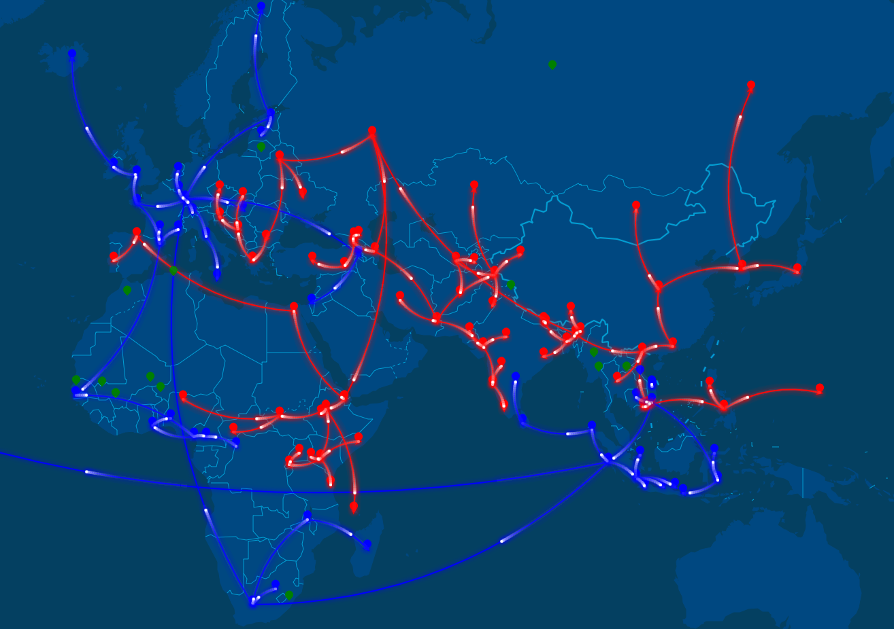

# "Tea by Sea, Cha by Land" Dataset 🍵

This repository archives a spatial-temporal dataset characterizing
how the word "tea" (茶) spread over the land and sea.

## Load the data

To load the data, use the following command in R:

```r
df = read.csv("tea-sea-cha-land.csv")
```

The R code for tidying the data is in [data-generator.R](data-generator.R).

### Visualization

We thank [@Lchiffon](https://github.com/Lchiffon) for contributing the visualization with computed possible tea trade paths for the dataset using his package [REmap](https://github.com/Lchiffon/REmap). The R code for creating the visualization is in [plot-remap.R](plot-remap.R).



# Data source

[World Atlas of Language Structures (WALS) database. Feature 138A: Tea.](http://wals.info/feature/138A#2/25.5/143.6)

## Read more

[Tea if by sea, cha if by land: Why the world only has two words for tea](https://qz.com/1176962/map-how-the-word-tea-spread-over-land-and-sea-to-conquer-the-world/), by Nikhil Sonnad. January 11, 2018.

[Tea if by Sea](https://languageoffood.blogspot.com/2014/08/tea-if-by-sea.html), by Dan Jurafsky. August 3, 2014.
